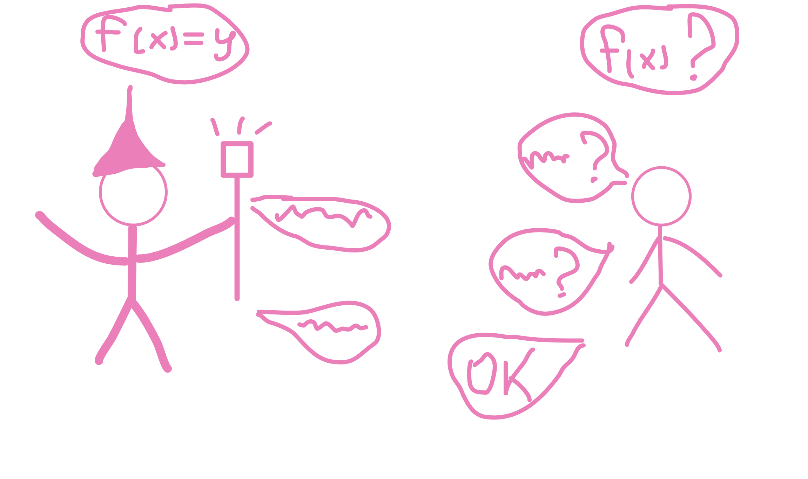
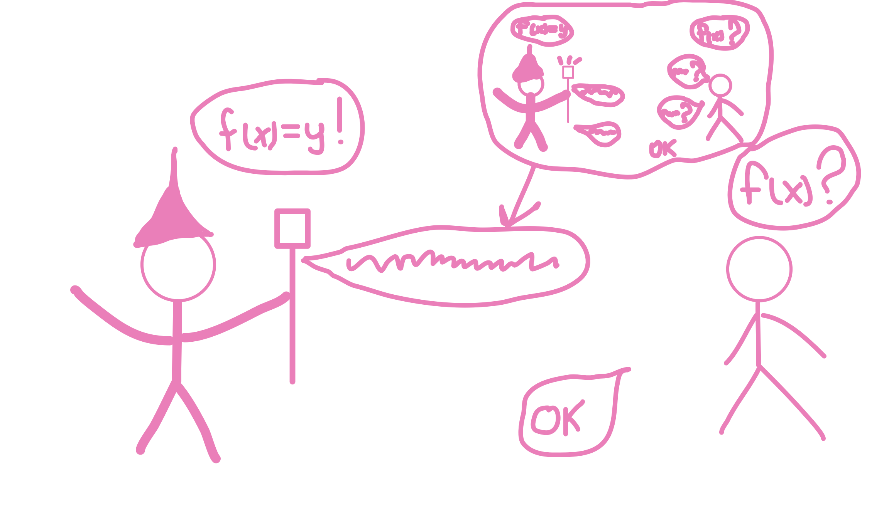
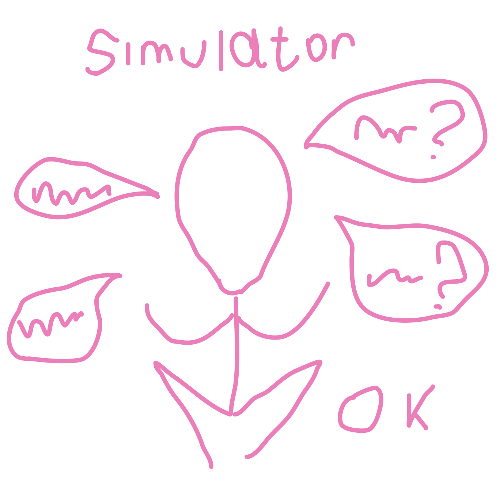
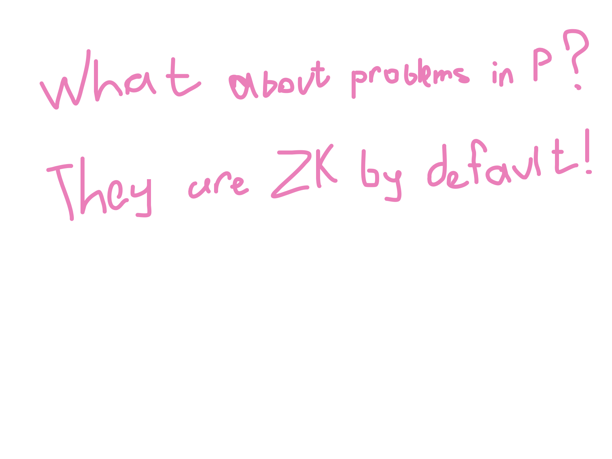
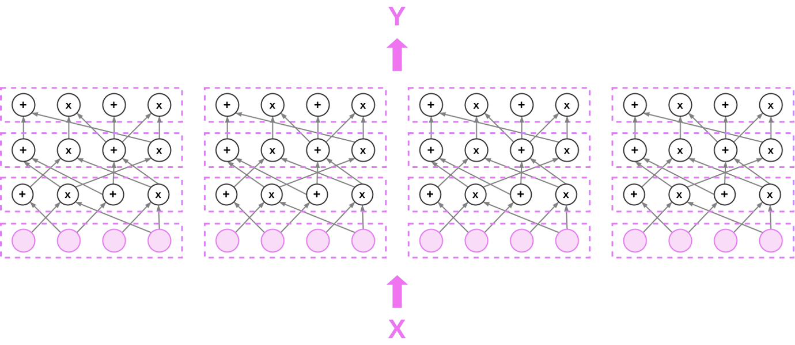
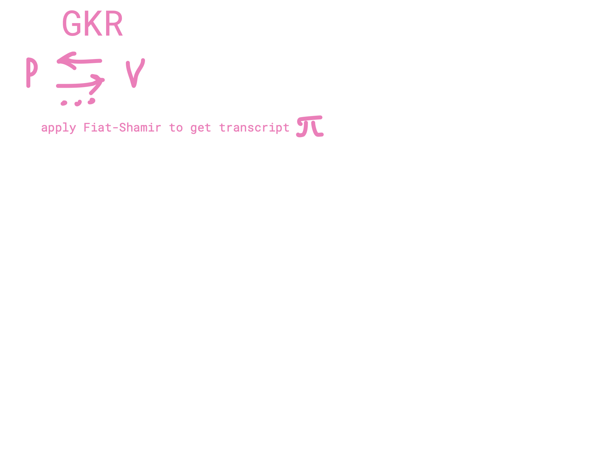
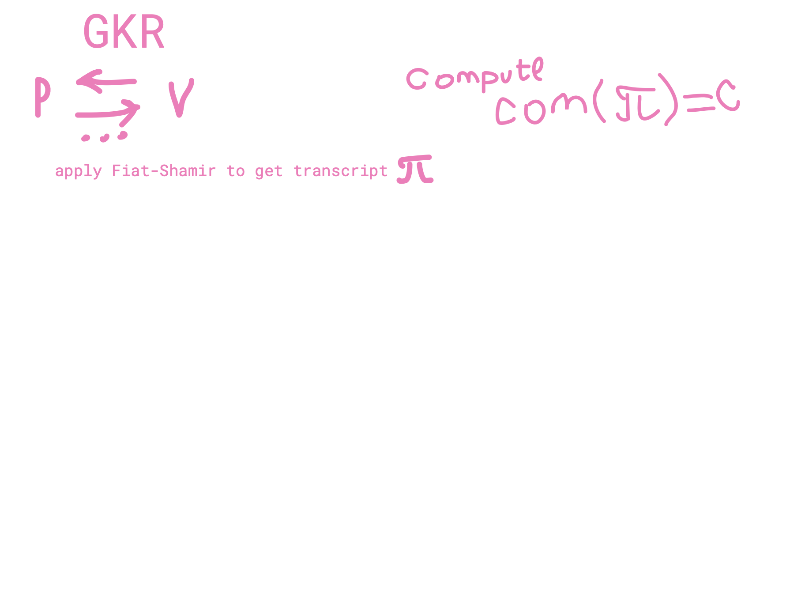
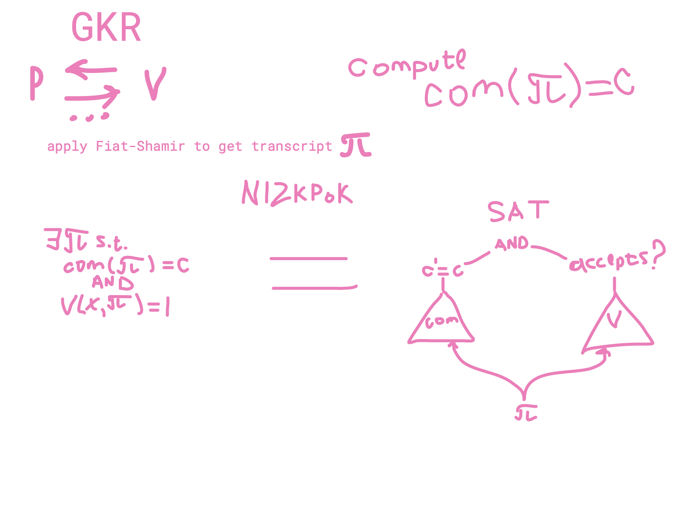
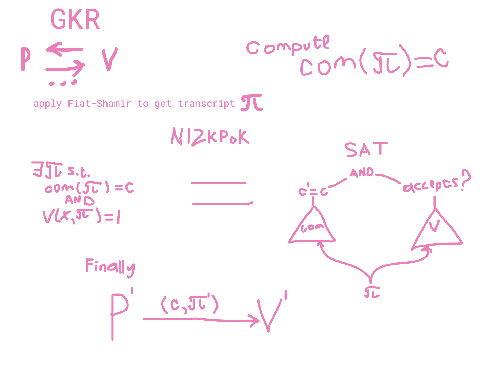

# GKR: Journey to NIZK Final presentation

 

*Ilia Zavidnyi* & *Svetlana Ivanova*
mentored by *Marshall Ball*
 
This presentation is part of a project that has received funding from the European Union’s Horizon 2020 research and innovation programme under the Marie Sklodowska-Curie grant agreement No. 823748.

---
# Proof system

---

# Non-interactivity via Fiat-Shamir

---

# Classical  Zero-knowledge

Verifier learns no information he can't *efficiently* compute himself.

This is formalised by showing that verifier has a *simulator* which can simulate prover-verifier interaction **in polynomial time**.

---

---

# GKR

*G*oldwasser, *K*alai, and *R*othblum described a interactive proof protocol which allows verifier to solve most problems in $\mathsf{P}$ **much** faster than it would be possible without prover.

Specifically, in **quasi-linear** time doing little more than reading the input.

---

# Precise  Zero-knowledge

Verifier learns no information he can't *efficiently* compute himself.

This is formalised by showing that verifier has a *simulator* which can simulate prover-verifier interaction **in time proportional to verifier's runtime**.

---

# How to construct precise NIZK from GKR?

---

# How to construct precise NIZK from GKR?

---

# How to construct precise NIZK from GKR?

---

# How to construct precise NIZK from GKR?

---

# Thank you for attention!

