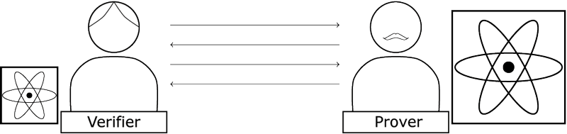
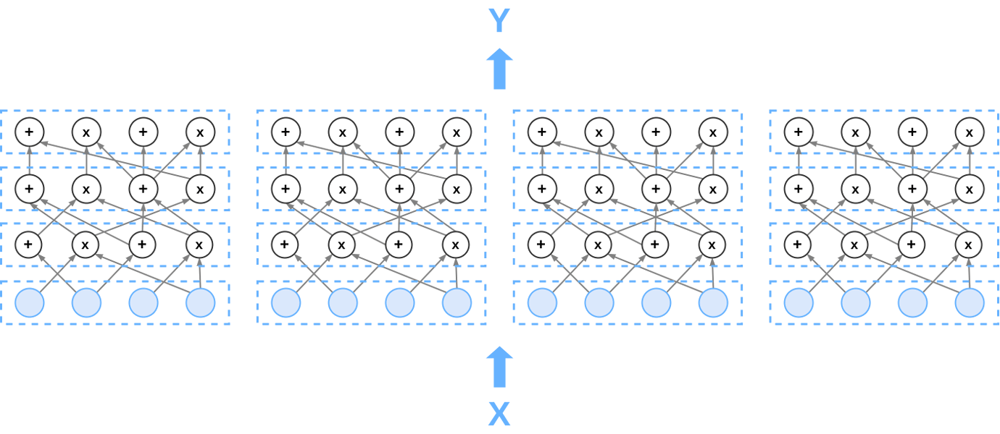

# GKR: Journey to NIZK
 

presentation *Ilia Zavidnyi*
mentored by *Marshall Ball*
 
This presentation is part of a project that has received funding from the European Union’s Horizon 2020 research and innovation programme under the Marie Sklodowska-Curie grant agreement No. 823748.

---

# Proof System

Verifier -> I want to delegate computation to an **untrusted party**
Prover -> I want verifier/client to accept my computation, so I can get **paid**

 
 

---

# Types of proofs

Interactive proof - verifier can exchange multiple messages with a prover

Non-interactive proof - communication consists of single message from the prover

Zero-knowledge (Informally) - any information verifier learns from prover he can compute himself in time close to what he spent interacting with a prover.

---

# GKR

*G*oldwasser, *K*alai, and *R*othblum described a interactive proof protocol which allows verifier to run **much** faster than it would be possible without prover.

Specifically, in **linear** time doing little more than reading the input.

---

# Goal

Take GKR on a journey to make it *N*on-*I*nteractive *Z*ero-*K*nowledge

## Problem

There is methodology to make it ZK, so it's feasible

Making it non-interactive (without random oracles) on top of that is problematic.

---

---